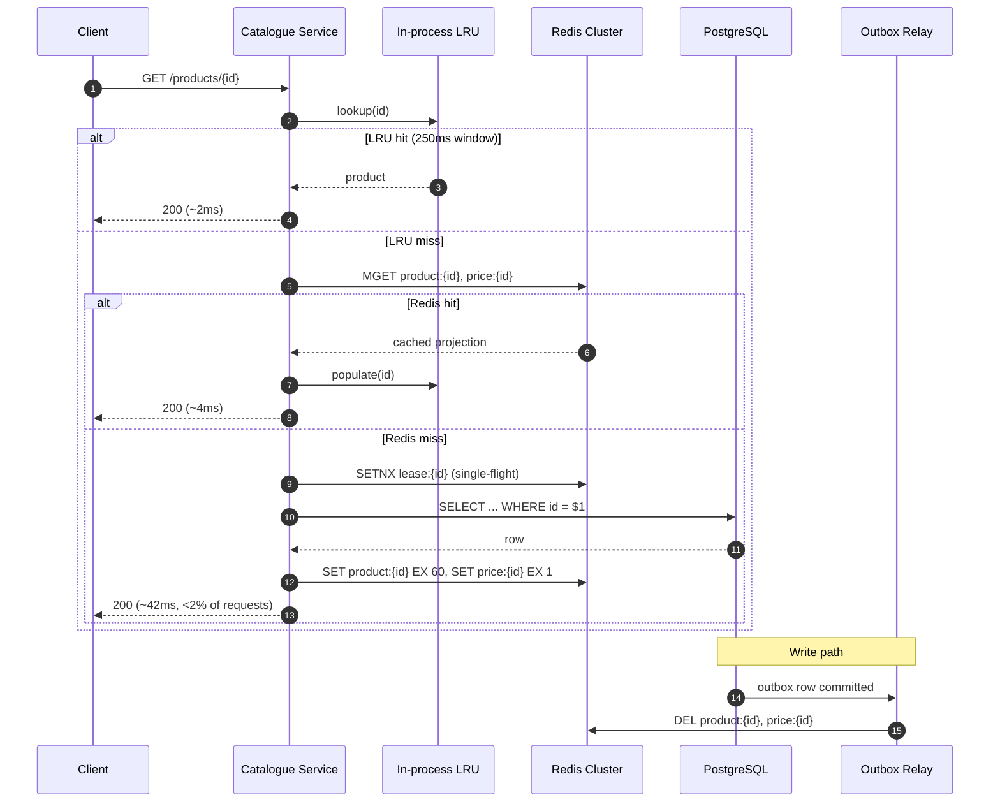

import TradeOffMatrix from '@/components/TradeOffMatrix';
import { Aside } from '@astrojs/starlight/components';

## Status

**Accepted** — 2026-09-11. Supersedes nothing. Revisit if catalogue write volume exceeds
5k writes/s or if the read:write ratio drops below 50:1.

## Context

The product catalogue read path serves ~40k req/s at peak from a single PostgreSQL primary
with two read replicas. Measured p99 for the hot `GET /products/{id}` path is 47ms, of which
~38ms is query execution plus replica lag stall. The product requirement is a $sub-10ms$ p99
at the service boundary.

Traffic is heavily skewed: the top 2% of SKUs account for ~78% of reads, and the catalogue
is written to roughly 900 times per hour — a read:write ratio near $1600{:}1$. Staleness of a
few seconds is acceptable for descriptions and imagery, but **price and stock must never be
served stale beyond 1s**, since checkout re-validates and a mismatch is a visible defect.

The latency budget decomposes as:

$$
p99_{\text{total}} = p99_{\text{net}} + p99_{\text{cache}} + (1 - h)\cdot p99_{\text{origin}}
$$

With $p99_{\text{net}} \approx 1.5\text{ms}$, $p99_{\text{cache}} \approx 1.2\text{ms}$ and
$p99_{\text{origin}} \approx 40\text{ms}$, hitting a 10ms budget requires a hit rate of:

$$
h \geq 1 - \frac{10 - 1.5 - 1.2}{40} = 1 - \frac{7.3}{40} \approx 0.8175
$$

So **any** viable option must sustain a hit rate above roughly $82\%$. Given the access skew,
that is achievable by all candidates — which makes the decision hinge on consistency control
and operational cost, not on raw hit rate.

## Decision

Adopt **cache-aside against a Redis cluster**, with:

- A 60s TTL for descriptive fields and a 1s TTL for the `price`/`stock` projection, stored as
  two separate keys so they expire independently.
- Explicit invalidation published from the catalogue write path via the outbox table, so a
  price change is evicted in the low tens of milliseconds rather than waiting out its TTL.
- Single-flight (`SETNX` lease) on miss to prevent stampedes on the hot 2% of SKUs.
- A small in-process LRU (5k entries, 250ms TTL) in front of Redis to absorb the extreme head
  of the distribution and shave the remaining network hop.

## Sequence

## Options Considered

<TradeOffMatrix
  caption="Read-path caching options, scored against the sub-10ms p99 budget and the 1s price-staleness ceiling."
  options={[
    {
      name: 'Cache-aside + Redis',
      summary: 'Service reads cache, falls back to DB, populates on miss.',
      recommended: true,
    },
    {
      name: 'Write-through + Redis',
      summary: 'Writes go to cache and DB synchronously.',
    },
    {
      name: 'Read replicas only',
      summary: 'Scale out PostgreSQL replicas, no cache tier.',
    },
    {
      name: 'CDN edge cache',
      summary: 'Cache full responses at the CDN by URL.',
    },
  ]}
  criteria={[
    {
      label: 'p99 read latency',
      description: 'At the service boundary, peak traffic.',
      cells: [
        { value: '~4ms at 98% hit', verdict: 'good' },
        { value: '~4ms at 99% hit', verdict: 'good' },
        { value: '~35ms best case', verdict: 'bad', note: 'Query execution dominates; no path to 10ms.' },
        { value: '~1ms on edge hit', verdict: 'good', note: 'But only for anonymous traffic.' },
      ],
    },
    {
      label: 'Price staleness',
      description: 'Hard ceiling of 1s.',
      cells: [
        { value: '≤1s via split TTL + outbox evict', verdict: 'good' },
        { value: '≈0s, cache is authoritative on write', verdict: 'good' },
        { value: 'Replica lag, typically 200ms–3s', verdict: 'mixed', note: 'Lag spikes under write bursts.' },
        { value: 'Minutes without purge API calls', verdict: 'bad' },
      ],
    },
    {
      label: 'Write-path coupling',
      description: 'Blast radius of a cache outage on writes.',
      cells: [
        { value: 'None — writes never touch Redis', verdict: 'good' },
        { value: 'Writes fail if Redis is down', verdict: 'bad', note: 'Turns a cache outage into a write outage.' },
        { value: 'None', verdict: 'good' },
        { value: 'None', verdict: 'good' },
      ],
    },
    {
      label: 'Cold-start / stampede risk',
      cells: [
        { value: 'Mitigated by SETNX lease', verdict: 'mixed', note: 'Requires the single-flight code path to be correct.' },
        { value: 'Low — cache filled on write', verdict: 'good' },
        { value: 'N/A', verdict: 'neutral' },
        { value: 'High on purge waves', verdict: 'bad' },
      ],
    },
    {
      label: 'Infra cost delta',
      description: 'Monthly, versus today.',
      cells: [
        { value: '+3-node Redis (~$420)', verdict: 'mixed' },
        { value: '+3-node Redis (~$420)', verdict: 'mixed' },
        { value: '+4 replicas (~$2.9k)', verdict: 'bad' },
        { value: '+CDN egress (~$260)', verdict: 'good' },
      ],
    },
    {
      label: 'Operational complexity',
      cells: [
        { value: 'Moderate — TTL + invalidation to own', verdict: 'mixed' },
        { value: 'High — dual-write correctness', verdict: 'bad' },
        { value: 'Low', verdict: 'good' },
        { value: 'Moderate — purge orchestration', verdict: 'mixed' },
      ],
    },
  ]}
/>

<Aside type="caution" title="Why not write-through">
Write-through gives the tightest consistency, but it places Redis on the write path. A cache
failure would then degrade a $900\text{ writes/hour}$ path that currently has a 99.99% SLO —
trading a read-latency problem for an availability problem. With a read:write ratio near
$1600{:}1$, the consistency gain is not worth the coupling.
</Aside>

## Consequences

**Positive**

- Meets the $sub-10ms$ p99 target with ~5x headroom on the required hit rate.
- Redis failure degrades latency back to today's 47ms p99 but keeps the service correct and
  available — the cache is strictly an optimisation.
- The split-TTL projection makes the price-staleness guarantee explicit and testable, rather
  than an emergent property of replica lag.

**Negative**

- Two write paths must now invalidate: the outbox relay is a new component on the critical
  correctness path for pricing. It needs its own lag alert.
- The in-process LRU makes each pod's view briefly divergent for up to 250ms; anything
  requiring read-your-writes must bypass both cache layers via an explicit flag.
- Single-flight leases introduce a lock that can leak on process kill; leases carry a 5s TTL
  as a backstop.

**Follow-ups**

- Add a `cache_hit_ratio` SLI with a burn-rate alert at $h < 0.90$.
- Load-test the miss path at 2% of 40k req/s (~800 req/s to PostgreSQL) to confirm the origin
  is not the new bottleneck.
