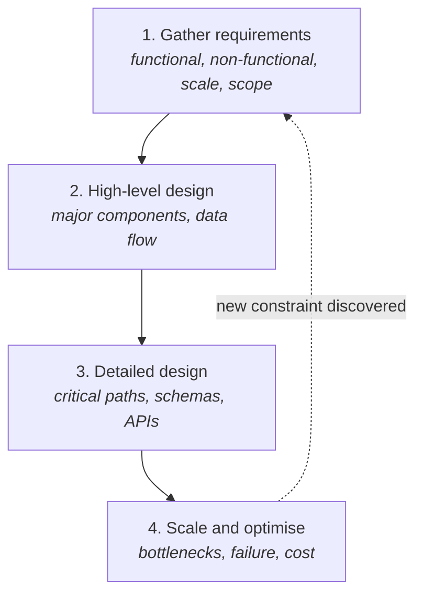

> The framework's real job is preventing the most common failure: jumping straight to
> components and rambling.

Four steps, in order. Each one earns the right to the next.

That dotted line matters. Finding a bottleneck in step 4 often means a requirement was wrong in
step 1, and going back is correct rather than embarrassing.

## Step 1 — Gather requirements

Clarify functional requirements, non-functional requirements, assumptions, constraints, and
scope. Establish the scale numbers here, because they select the design.

The output of this step should be writable in a few lines: what it does, how well, for how many
users, and what's explicitly out of scope. See
[Requirements](../requirements/) and [Estimation](../estimation/).

**Done when** you could state the problem back in a way the asker would agree with.

## Step 2 — High-level design

Major components and how data moves between them. Stay broad deliberately — clients, load
balancer, application servers, datastore, cache, queue, object storage. Boxes and arrows.

The discipline is resisting depth. A high-level design that's already arguing about index types
has skipped the part where you check the overall shape is right.

**Done when** every functional requirement has a visible path through the diagram.

## Step 3 — Detailed design

Now go deep — but only where it matters. Pick the one or two components where the problem
actually lives, and work them properly: schema, API shape, the critical read and write paths,
and the trade-off you're making.

Choosing *where* to dive is the skill. In a feed product it's timeline generation, not user
signup. In a payments product it's the consistency of the ledger, not the profile page.

**Done when** the hard part has a concrete mechanism, not a label.

## Step 4 — Scale and optimise

Find what breaks first, then address it: caching, replication, sharding, failover, monitoring,
cost. This is also where you name single points of failure and say what happens when each
dependency is unavailable.

**Done when** you can answer "what fails at 10x?" without guessing.

## Why the order is not negotiable

Each step's output is the next step's input. Skipping produces recognisable failures:

| Skipped step | What goes wrong |
| --- | --- |
| Requirements | You design the wrong system, precisely |
| High-level design | Deep detail on a component that shouldn't exist |
| Detailed design | A diagram with no mechanism behind the hard part |
| Scale and optimise | A design that works only at today's traffic |

## In interviews

The framework maps onto what interviewers are actually scoring, which is reasoning rather than
recall:

| Step | What it demonstrates | Rough time (45 min) |
| --- | --- | --- |
| Requirements | You understand the problem | 5–10 min |
| High-level design | You can see a whole system | 10–15 min |
| Detailed design | You have technical depth | 15–20 min |
| Scale and optimise | You've thought about production | 10–15 min |

Two things worth knowing. Candidates who spend two minutes on requirements almost always design
the wrong thing, and candidates who never leave requirements never show depth — the budget is
real in both directions.

The other: interviewers reward structure over complexity. A clean, well-reasoned design with
stated trade-offs beats an elaborate one that arrived without justification.

## The habit

Announce the step you're on. "Let me start with requirements" — then actually gather them.
"Moving to the high-level design" — then draw it. It sounds mechanical, and it is; that's the
point. It's what stops a design discussion from becoming a list of technologies you've heard of.
