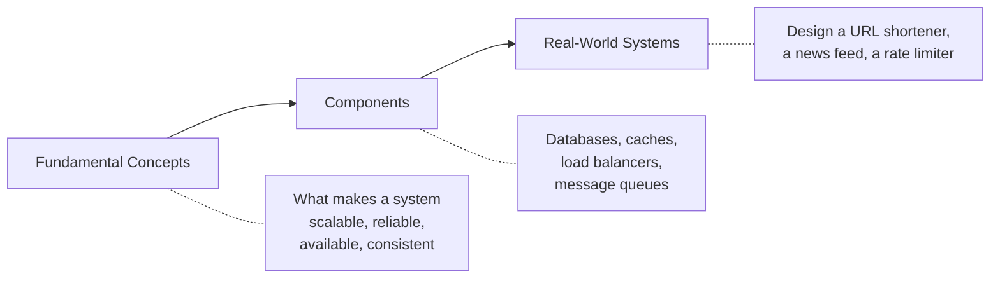

> Anyone can code a feature. Knowing **what** to implement and **why** is the real skill.

## 1. The gap this fills

Most of us learn to build by being handed a task: add this endpoint, fix this bug, wire up
this form. That work is well defined, and you get good at it fast. Someone else already
decided what should exist and how the pieces fit.

System design is that missing decision. It answers questions nobody hands you:

- Should this be one service or three?
- Does this data belong in a relational database, a cache, or a queue?
- What happens to everything else when this one component dies?

You can write flawless code inside a bad design and still end up with a system that falls
over. The code was never the constraint.

## 2. Knowing what happens when something happens

The second reason to learn this is that it lets you **predict** instead of react.

Take a concrete case. Your app works fine with 100 users. Traffic goes to 100,000. What
actually happens?

Without system design, that's a mystery you debug at 2am. With it, you can reason through it
in order, because load always surfaces the weakest layer first:

| Load arrives at | What breaks first | Usual fix |
| --- | --- | --- |
| Web/app servers | CPU saturates, requests queue | Add servers behind a load balancer |
| Database connections | Connection limit hit, requests refused | Connection pooling |
| Database reads | Queries slow down, then time out | Add indexes, read replicas, caching |
| Database writes | Replication lag, lock contention | Batching, partitioning, sharding |

The useful part isn't memorising this table. It's the habit of asking *"what is the limit
here, and what happens when I hit it?"* — for every component you add.

Notice the fixes get progressively harder. Adding a server is an afternoon. Sharding a
database is a migration you plan for weeks. That ordering is itself a design insight: the
cheap moves buy you time to avoid the expensive ones.

## 3. How this section is organised

Three stages, in dependency order — each one needs the previous.

**Fundamental concepts** — the properties we actually care about, and what they cost.
Scalability, reliability, availability, consistency, latency and throughput. These are the
vocabulary; without them you can't state what a design is even trying to achieve.

**Components** — the building blocks, and crucially what each one is *bad* at. A cache makes
reads fast and introduces staleness. A queue absorbs bursts and adds delay. Every component
is a trade.

**Real-world systems** — putting it together on problems with no clean answer. This is where
the first two stages stop being theory.

## 4. There is no perfect design

This is the part worth internalising early, because it reframes everything else.

In system design there is almost never a correct answer — only answers that are right *for a
given set of constraints*. Every choice you make gives something up:

| Choice | You gain | You give up |
| --- | --- | --- |
| Add a cache | Fast reads | Data can be stale |
| Add a read replica | Read capacity | Replica lags behind the primary |
| Split into microservices | Independent deploys, isolated failure | Network calls, harder debugging |
| Add a message queue | Absorbs traffic spikes, decouples services | Delay, plus a new thing that can break |
| Shard the database | Write capacity beyond one machine | Cross-shard joins and transactions get hard |

Look at the right-hand column. None of those are bugs — they're the price. Caches *are*
stale; that's how they're fast. The skill isn't avoiding the cost, it's knowing which costs
you can live with for the problem in front of you.

Which is why "it depends" is a legitimate answer in system design, as long as you can finish
the sentence. *It depends on whether reads outnumber writes. It depends on whether users
would notice one second of stale data. It depends on whether we have one team or six.*

A design without a stated constraint isn't a design — it's a preference. Every note in this
section tries to name the constraint first, then the trade.

## 5. What to take from this

- Features are the easy part. Deciding what should exist and why is the skill worth building.
- For every component, know its limit and what happens when you reach it.
- Read in order: concepts, then components, then real systems.
- Never evaluate a design in the abstract. Ask what it optimises for and what it sacrifices.
